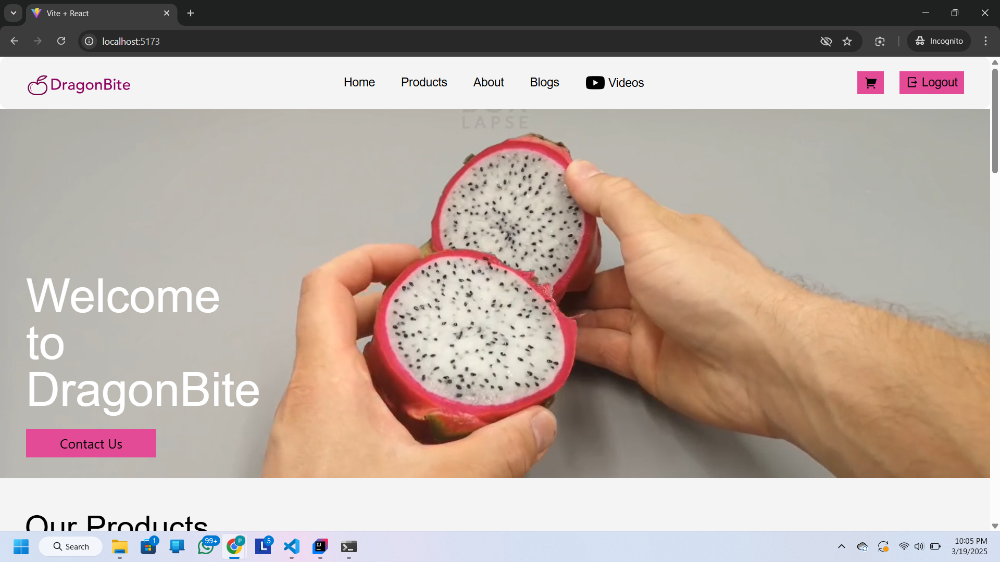
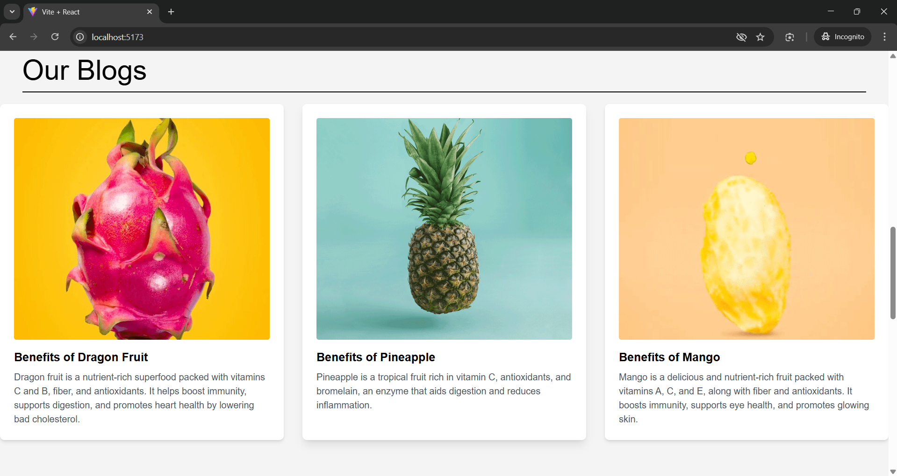
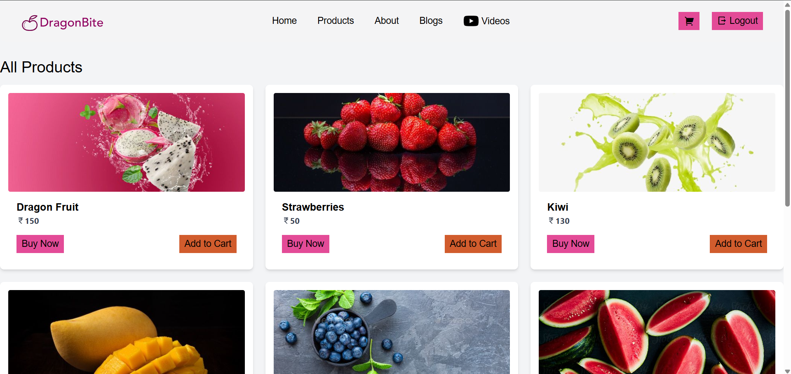
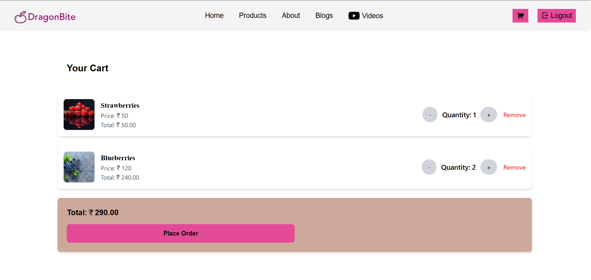

#  🍎 DragonBite – Full Stack E-commerce Platform

DragonBite is a modern full-stack e-commerce web application built using **React (Frontend)** and **Spring Boot (Backend)**. It includes features like JWT authentication, cart management, real-time notifications, admin dashboard, and more.

---

## 🚀 Features

- 🛍️ **User Features**
  - Product browsing and cart management
  - User authentication with JWT
  - Role-based access control (RBAC)

- ⚙️ **Admin Features**
  - Admin dashboard for managing users and products
  - Inventory control and stock updates
  - View and manage orders

- 🔔 **Services**
  - Notification service (email/SMS-ready)
  - Redis for caching performance
  - JWT-secured microservices architecture

---

## 📸 Demo

### 🎥 Project Video Walkthrough  
👉 [Watch Demo Video](https://drive.google.com/file/d/1AaasFS6NYisMNymxjrOhzguBPGnFWqwE/view?usp=sharing)

### 🖼️ Screenshots

| Home Page | Product Page | Admin Dashboard |
|-----------|--------------|-----------------|
|  |  |  |

---

## 🛠️ Tech Stack

**Frontend:**
- React
- TailwindCSS / CSS

**Backend:**
- Spring Boot (Java)
- MySQL
- Redis
- JWT (Role-based access control)

**Others:**
- Maven
- Postman (for API testing)

**Built with ❤️ by Priyanshu Jain**
**Part of personal learning and system design exploration.**

